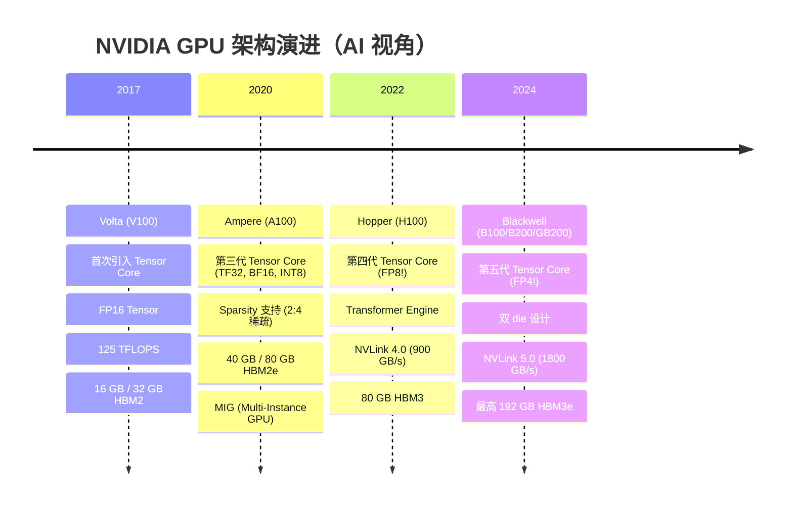

# NVIDIA GPU 架构演进

> 从 Volta 到 Blackwell，理解每一代 NVIDIA GPU 架构的核心改进及其对 AI 工作负载的影响。

## 为什么要了解 GPU 架构？

你可能会问："我又不设计 GPU，为什么要关心它的内部结构？"

原因是：**当你优化 CUDA kernel、选择并行策略、排查训练性能问题时，所有决策的底层逻辑都来自硬件限制**。比如：
- 为什么 Tensor Parallel 通常优先放在机内？→ 因为它通信频繁且时延敏感，机内 NVLink/NVSwitch 往往比跨机网络更合适
- 为什么 H100 训练 LLM 比 A100 快 3x 而不只是快 50%？→ 因为 Transformer Engine 和 FP8 Tensor Core
- 为什么模型推理时显存比算力更容易成为瓶颈？→ 因为 GPU 的 FLOPS 增长远快于 HBM 带宽增长

了解这些硬件特性不需要你成为芯片设计师，但能让你**在做系统决策时有正确的直觉**。

## 核心概念

### Streaming Multiprocessor（SM，流式多处理器）— GPU 的基本计算单元

SM 是构成 GPU 的核心模块。如果把 GPU 比作一个工厂，那每个 SM 就是一个**独立的车间**——有自己的工人（CUDA Core、Tensor Core）、工作台（Shared Memory）、工具柜（Register File）和调度员（Warp Scheduler）。一个 GPU 由数十到上百个这样的车间组成：

```
┌──────────────────── SM (Streaming Multiprocessor) ────────────────────┐
│                                                                       │
│  ┌─────────────┐  ┌─────────────┐  ┌─────────────┐  ┌─────────────┐ │
│  │ Sub-core 0  │  │ Sub-core 1  │  │ Sub-core 2  │  │ Sub-core 3  │ │
│  │ 32 FP32     │  │ 32 FP32     │  │ 32 FP32     │  │ 32 FP32     │ │
│  │ 1 Tensor    │  │ 1 Tensor    │  │ 1 Tensor    │  │ 1 Tensor    │ │
│  │ Core        │  │ Core        │  │ Core        │  │ Core        │ │
│  │ Warp Sched  │  │ Warp Sched  │  │ Warp Sched  │  │ Warp Sched  │ │
│  │ Register    │  │ Register    │  │ Register    │  │ Register    │ │
│  │ File 16K    │  │ File 16K    │  │ File 16K    │  │ File 16K    │ │
│  └─────────────┘  └─────────────┘  └─────────────┘  └─────────────┘ │
│                                                                       │
│  ┌─────────────────────────────────────────────────────────────────┐  │
│  │         Shared Memory / L1 Cache (可配置，如 164 KB)            │  │
│  └─────────────────────────────────────────────────────────────────┘  │
└───────────────────────────────────────────────────────────────────────┘
```

以上以 Hopper (H100) 的 SM 为例，细节因架构代际而异。

### 架构代际演进



### 关键架构对比

| 特性 | V100 | A100 | H100 | B200 |
|------|------|------|------|------|
| SM 数量 | 80 | 108 | 132 | 160+ |
| CUDA Cores / SM | 64 | 64 | 128 | 128 |
| Tensor Cores / SM | 8 | 4 (更强) | 4 (更强) | 4 (更强) |
| FP16 Tensor 峰值* (TFLOPS) | 125 | 312 | 1,979 | ~4,500 |
| FP8 Tensor 峰值* (TFLOPS) | — | — | 3,958 | ~9,000 |
| HBM 带宽 (TB/s) | 0.9 | 2.0 | 3.35 | 8.0 |
| HBM 容量 | 32 GB | 80 GB | 80 GB | 192 GB |
| NVLink 带宽 (双向) | 300 GB/s | 600 GB/s | 900 GB/s | 1,800 GB/s |
| TDP | 300W | 400W | 700W | 1000W |

> * 上表中的 A100/H100/B200 Tensor 峰值采用常见的厂商宣传口径，通常包含结构化稀疏带来的加速；做 dense 算法分析、roofline 建模或 MFU 估算时，应确认对应的 dense 峰值。

> 注意 Tensor Core 峰值从 V100→H100 的增长远快于 HBM 带宽增长。这意味着 **memory bandwidth 越来越成为瓶颈**。

## 关键细节

### Tensor Core 的工作方式

Tensor Core 的核心操作是 **WMMA（Warp Matrix Multiply-Accumulate）**：

$$D = A \times B + C$$

其中 A、B、C、D 是小矩阵（如 16×16），一条指令完成整个矩阵乘加：

```
一个 Tensor Core 指令:
  A (16×16, FP16) × B (16×16, FP16) + C (16×16, FP32) → D (16×16, FP32)

vs CUDA Core:
  每条指令只做 a * b + c（标量 FMA）
```

不同精度的 Tensor Core 支持：

| 架构 | 支持的输入精度 |
|------|---------------|
| Volta | FP16 |
| Ampere | FP16, BF16, TF32, INT8, INT4 |
| Hopper | FP16, BF16, TF32, FP8 (E4M3/E5M2), INT8 |
| Blackwell | FP16, BF16, TF32, FP8, FP4, INT8 |

### NVLink & NVSwitch — GPU 间通信

多卡训练时，GPU 之间需要高速通信（如 AllReduce 梯度）。

```
PCIe Gen5:  ~64 GB/s（双向）    ← 带宽明显更低
NVLink 4.0: ~900 GB/s（双向）   ← H100 机内高速互联
NVSwitch:   交换式全互联语义      ← 通过交换芯片把多 GPU 织成高带宽网络
```

```
8x H100 DGX 系统（NVSwitch 交换式全互联）:

  GPU0 ──── GPU1
  │  ╲    ╱  │
  │   ╲  ╱   │
  │    ╲╱    │
  │    ╱╲    │
  │   ╱  ╲   │
  │  ╱    ╲  │
  GPU2 ──── GPU3
    ...
  GPU 先连到 NVSwitch，再通过交换芯片互通
  总 bisection bandwidth: 900 GB/s × 8 = 7.2 TB/s
```

### MIG（Multi-Instance GPU）— A100+ 独有

MIG 允许将一个物理 GPU 划分为最多 7 个独立的 GPU 实例，每个实例有独立的 SM、显存和带宽。适用于推理服务中多个小模型共享一张卡。

### Transformer Engine — H100+ 独有

H100 引入的 Transformer Engine 能在 FP8 和 FP16 之间**动态切换精度**：

```
Forward Pass:
  每一层的输入/输出统计 → 动态计算 scale factor → 决定使用 FP8 还是 FP16
  
目标: 尽可能用 FP8（速度翻倍）同时保持精度不损失
```

这是 H100 能在 LLM 训练中比 A100 快 3-4x 的核心原因之一。

## 常见问题

**Q: 为什么 Tensor Core 的 TFLOPS 比 CUDA Core 高这么多？**

A: 因为 Tensor Core 做的是矩阵级别的 FMA，一条指令完成 16×16×16 = 4096 次乘加运算。而 CUDA Core 一条指令只做 1 次 FMA。所以同样的时钟周期内，Tensor Core 的"有效 FLOPS"远高于 CUDA Core。

**Q: TF32 是什么？为什么 A100 引入它？**

A: TF32 = TensorFloat-32，是 NVIDIA 发明的一种特殊格式：8-bit 指数（和 FP32 一样）+ 10-bit 尾数（和 FP16 一样）。它的数值范围和 FP32 一样大，但精度和 FP16 接近。Ampere 的 Tensor Core 能以比纯 FP32 更高的速度运算 TF32，且对大多数深度学习任务不影响收敛。需要注意的是，PyTorch 对 TF32 的默认行为带有版本差异：旧版本常直接通过 `allow_tf32` 控制；当前文档里更推荐使用更细粒度的 `fp32_precision` / matmul precision 设置来管理。

**Q: 选 GPU 时最该关注哪个指标？**

A: 取决于工作负载：
- **训练**：Tensor Core TFLOPS（决定 GEMM 速度） + HBM 带宽（决定数据搬运速度） + NVLink 带宽（决定多卡通信速度）
- **推理（生成式）**：HBM 带宽是首要瓶颈（token 生成是 memory-bound），其次是显存容量（决定能装多大的模型）

**Q: 消费级 GPU（如 RTX 4090）能用于训练吗？**

A: 能，但有限制：
- RTX 4090 有 16,384 CUDA Cores + 第四代 Tensor Core，FP16 算力很强
- 但只有 24 GB GDDR6X（vs H100 的 80 GB HBM3），显存容量和带宽都差距大
- 没有 NVLink（消费级已取消），多卡只能走 PCIe，通信是大瓶颈
- 适合小模型训练/微调和推理实验，不适合大规模分布式训练

## 延伸阅读

- [NVIDIA H100 Whitepaper](https://resources.nvidia.com/en-us-tensor-core) — 官方架构白皮书
- [NVIDIA Blackwell Architecture](https://www.nvidia.com/en-us/data-center/technologies/blackwell-architecture/) — B200 架构介绍
- [A100 vs H100 Deep Dive](https://timdettmers.com/2023/01/30/which-gpu-for-deep-learning/) — Tim Dettmers 的 GPU 选购指南
- [Tensor Core 工作原理](https://developer.nvidia.com/blog/programming-tensor-cores-cuda-9/) — NVIDIA Developer Blog

---

## 术语表

| 术语 | 说明 |
|------|------|
| **SM（Streaming Multiprocessor）** | GPU 的基本计算模块。每个 SM 包含若干 CUDA Core、Tensor Core、Warp Scheduler、寄存器堆和 Shared Memory |
| **Tensor Core** | SM 内专用于矩阵乘加（MMA）的硬件单元，单指令可完成一个小矩阵（如 16×16）的乘加运算 |
| **WMMA** | Warp Matrix Multiply-Accumulate，Tensor Core 的编程接口，以 warp（32 线程）为单位执行矩阵乘加 |
| **NVLink** | NVIDIA GPU 之间的高速点对点互联，带宽远超 PCIe（H100 NVLink 4.0 双向 900 GB/s） |
| **NVSwitch** | 专用交换芯片，把一台机器内的多张 GPU 组织成高带宽交换网络；语义上接近全互联，但不是每对 GPU 都有独立的物理直连链路 |
| **MIG（Multi-Instance GPU）** | A100+ 支持的功能，将一张物理 GPU 切分为最多 7 个独立的 GPU 实例，每个有隔离的 SM 和显存 |
| **Transformer Engine** | H100+ 内置的硬件加速模块，能动态在 FP8 和 FP16 之间切换精度，在不损失训练精度的前提下提速 |
| **TF32（TensorFloat-32）** | NVIDIA 定义的特殊浮点格式：8 位指数（同 FP32）+ 10 位尾数（同 FP16）。兼顾范围和速度 |
| **FP8** | 8 位浮点数格式（E4M3 或 E5M2），Hopper 架构原生支持，是目前最低精度的 Tensor Core 数据类型 |
| **ECC** | Error-Correcting Code，显存纠错功能。会占用约 6% 的显存容量，但能防止长时间训练中的 bit flip 错误 |
| **TDP** | Thermal Design Power，热设计功耗，表示芯片满载时的最大功耗 |
