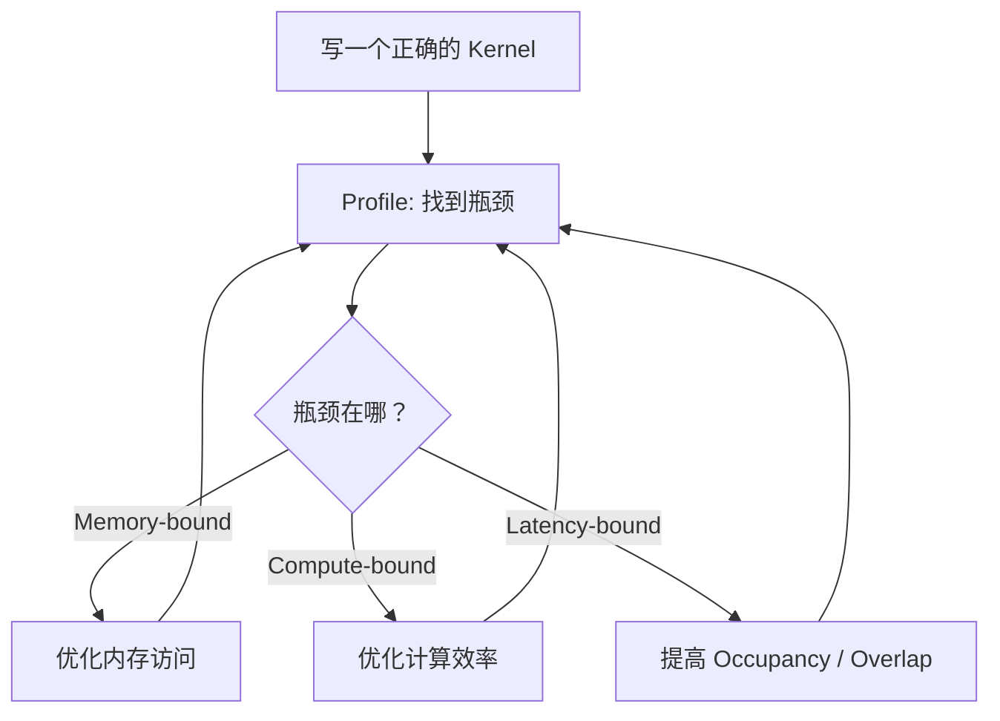

# CUDA 优化技巧

> 从 Profile 到 Optimize：系统化的 CUDA kernel 性能调优方法。

## 核心概念

### 优化工作流



**第一原则：先 Profile，再优化。不要猜。**

### Profiling 工具

| 工具 | 用途 | 粒度 |
|------|------|------|
| `nvidia-smi` | 查看 GPU 使用率、显存 | 设备级 |
| **Nsight Systems** (`nsys`) | 时间线分析（kernel、memcpy、CPU/GPU overlap） | 系统级 |
| **Nsight Compute** (`ncu`) | 单个 kernel 深度分析（roofline、stall 原因） | Kernel 级 |
| PyTorch Profiler | PyTorch 层面的 trace | 算子级 |

```bash
# Nsight Systems: 采集时间线
nsys profile --stats=true ./my_app

# Nsight Compute: 分析特定 kernel
ncu --set full --target-processes all ./my_app

# Nsight Compute: 只分析某一个 kernel
ncu --kernel-name myKernel --launch-count 1 ./my_app
```

## 关键细节

### 1. Memory Coalescing（合并访存）

**最重要的优化之一。** Warp 中 32 个线程的内存请求会被合并：

```cuda
// ✅ Coalesced: 连续线程访问连续地址
// Thread 0 → data[0], Thread 1 → data[1], ..., Thread 31 → data[31]
data[threadIdx.x]  // 一次 128B 事务

// ❌ Strided: 间隔访问
// Thread 0 → data[0], Thread 1 → data[stride], Thread 2 → data[2*stride]
data[threadIdx.x * stride]  // 需要多次事务

// ❌ Random: 随机访问
data[hash(threadIdx.x)]  // 最坏 32 次事务
```

**实际影响**：coalesced vs strided 可以有 **10-30x** 的性能差距。

**AoS vs SoA**：

```cuda
// ❌ AoS (Array of Structs) — 访问单个字段时不 coalesced
struct Particle { float x, y, z, w; };
Particle particles[N];
// Thread i 访问 particles[i].x → 间隔 16 bytes

// ✅ SoA (Struct of Arrays) — 访问单个字段时 coalesced
struct Particles { float *x, *y, *z, *w; };
// Thread i 访问 x[i] → 连续地址
```

### 2. Occupancy 优化

```
高 Occupancy → 更多 warp 可切换 → 更好的 Latency Hiding
但：Occupancy 不是唯一目标！

影响 Occupancy 的因素:
  ┌────────────────┐
  │ Registers/thread │ ↑使用越多 → Occupancy ↓
  ├────────────────┤
  │ Shared Mem/block │ ↑使用越多 → Occupancy ↓
  ├────────────────┤
  │ Block Size      │ 太大或太小都可能降低 Occupancy
  └────────────────┘
```

```cuda
// 限制每线程寄存器数量（牺牲单线程性能换取更高 occupancy）
__global__ __launch_bounds__(256, 4)  // 每 block 256 threads, 至少 4 blocks/SM
void myKernel(...) { ... }

// 编译时限制
nvcc -maxrregcount=32 mykernel.cu
```

### 3. Warp-level Primitives

现代 CUDA 提供 warp 级别的高效操作，避免通过 shared memory 中转：

```cuda
// Warp Shuffle: warp 内线程直接交换 register 中的值
int val = __shfl_xor_sync(0xFFFFFFFF, myVal, 1);  // 与邻居交换
int val = __shfl_down_sync(0xFFFFFFFF, myVal, 1);  // 向下传递
int val = __shfl_sync(0xFFFFFFFF, myVal, 0);       // 广播 thread 0 的值

// Warp Vote: warp 内条件投票
int all = __all_sync(0xFFFFFFFF, predicate);    // 是否所有线程都满足
int any = __any_sync(0xFFFFFFFF, predicate);    // 是否有线程满足
int ballot = __ballot_sync(0xFFFFFFFF, pred);   // 32-bit mask

// Warp Reduce (CUDA 9.0+, 通过 cooperative groups):
#include <cooperative_groups.h>
#include <cooperative_groups/reduce.h>
namespace cg = cooperative_groups;
auto warp = cg::tiled_partition<32>(cg::this_thread_block());
float sum = cg::reduce(warp, val, cg::plus<float>());
```

**Warp-level Reduction**（手动实现）：

```cuda
// 比 shared memory reduction 更快（省了 shared memory 读写）
__device__ float warp_reduce_sum(float val) {
    for (int offset = 16; offset > 0; offset >>= 1)
        val += __shfl_down_sync(0xFFFFFFFF, val, offset);
    return val;  // thread 0 持有结果
}
```

### 4. 向量化访存

```cuda
// 标量加载: 每线程一次读 4 bytes
float val = data[idx];

// 向量化加载: 每线程一次读 16 bytes (4 个 float)
float4 val = reinterpret_cast<float4*>(data)[idx];
// → 更少的内存事务，更高的带宽利用率

// 使用 __ldg() 显式通过 read-only cache 加载
float val = __ldg(&data[idx]);
```

### 5. Loop Unrolling

```cuda
// 编译器提示展开循环
#pragma unroll
for (int i = 0; i < TILE_SIZE; i++) {
    sum += As[ty][i] * Bs[i][tx];
}

// 指定展开因子
#pragma unroll 4
for (int i = 0; i < N; i++) { ... }
```

### 6. CUDA Streams — Overlap Compute & Transfer

```
单 Stream:
  [H2D] → [Kernel] → [D2H]
  总时间 = t_H2D + t_kernel + t_D2H

多 Stream (Overlap):
  Stream 0: [H2D_0] [Kernel_0] [D2H_0]
  Stream 1:     [H2D_1] [Kernel_1] [D2H_1]
  Stream 2:         [H2D_2] [Kernel_2] [D2H_2]
  
  总时间 ≈ max(t_H2D, t_kernel, t_D2H) + 少量开销
```

前提：
- H2D/D2H 必须使用 **pinned memory** + `cudaMemcpyAsync`
- GPU 有独立的 copy engine 和 compute engine，可以同时工作
- 高端 GPU（如 H100）有 2 个 copy engine（一个 H2D，一个 D2H）

## 代码示例

### 完整的优化对比：Vector Add

```cuda
// V1: 朴素
__global__ void vec_add_v1(float *a, float *b, float *c, int N) {
    int i = blockIdx.x * blockDim.x + threadIdx.x;
    if (i < N) c[i] = a[i] + b[i];
}

// V2: 向量化 + Grid-stride Loop
__global__ void vec_add_v2(float *a, float *b, float *c, int N) {
    int i = (blockIdx.x * blockDim.x + threadIdx.x) * 4;
    int stride = gridDim.x * blockDim.x * 4;
    
    for (; i + 3 < N; i += stride) {
        float4 va = reinterpret_cast<float4*>(a)[i/4];
        float4 vb = reinterpret_cast<float4*>(b)[i/4];
        float4 vc;
        vc.x = va.x + vb.x;
        vc.y = va.y + vb.y;
        vc.z = va.z + vb.z;
        vc.w = va.w + vb.w;
        reinterpret_cast<float4*>(c)[i/4] = vc;
    }
    // 处理余数
    for (int j = i; j < N; j += gridDim.x * blockDim.x)
        if (j < N) c[j] = a[j] + b[j];
}
```

## 常见问题

**Q: Profile 显示 kernel 是 memory-bound，怎么优化？**

A: 按优先级：
1. 确保 coalesced access
2. 使用 shared memory 缓存重复读取的数据
3. 向量化访存（float4）
4. 减少总的内存访问量（算法层面）
5. 考虑是否能用 `__ldg()` 或 texture cache

**Q: 什么是 Grid-stride Loop？为什么要用它？**

A: Grid-stride Loop 让每个线程处理多个元素，而不是只处理一个：
```cuda
for (int i = blockIdx.x * blockDim.x + threadIdx.x; 
     i < N; 
     i += gridDim.x * blockDim.x) {
    // process element i
}
```
好处：(1) 一个 kernel 可以处理任意大小的数据 (2) 可以选择最优的 grid size 而不是被数据量决定 (3) 有时能提高 cache 命中率

**Q: `__restrict__` 关键字有什么用？**

A: 告诉编译器指针不会别名（alias），允许更激进的优化（如指令重排、向量化）：
```cuda
__global__ void kernel(float * __restrict__ a, 
                       float * __restrict__ b, 
                       float * __restrict__ c) { ... }
```

## 延伸阅读

- [CUDA C++ Best Practices Guide](https://docs.nvidia.com/cuda/cuda-c-best-practices-guide/) — 官方最佳实践
- [Nsight Compute Documentation](https://docs.nvidia.com/nsight-compute/)
- [CUTLASS: CUDA Templates for Linear Algebra Subroutines](https://github.com/NVIDIA/cutlass)
