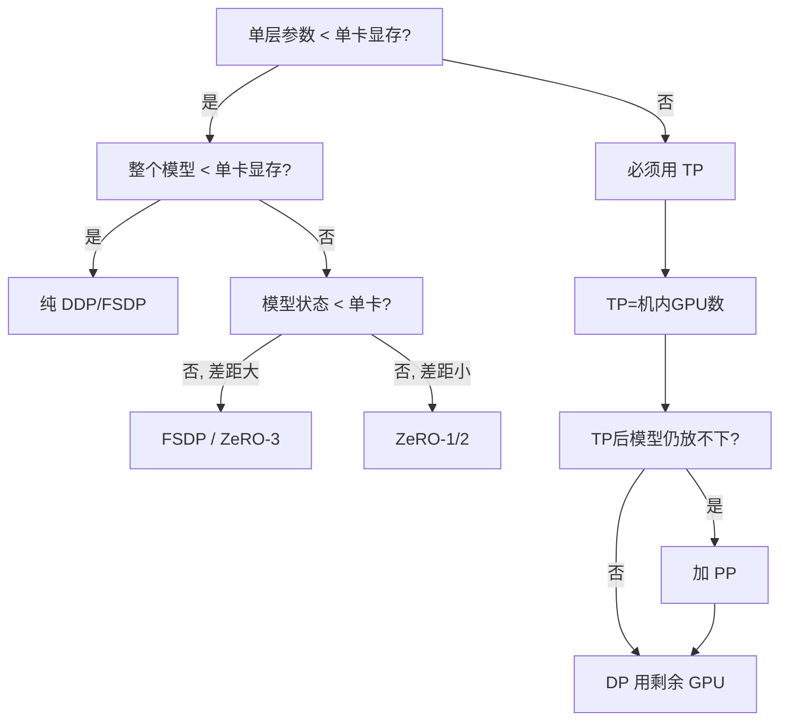

# 训练并行策略选型指南

> 给定模型大小、硬件配置和训练需求，如何选择 DP/TP/PP/EP 的组合？

## 选型决策树



## 速查表

| 模型规模 | 推荐策略 (8卡/机) | 说明 |
|---------|------------------|------|
| **< 2B** | DDP (DP=N) | 单卡放得下，纯数据并行 |
| **2-10B** | ZeRO-2 (DP=N) | 优化器分片节省显存，通信量和DDP相同 |
| **10-30B** | TP=8 + DP=N/8 | 单卡放不下需要 TP，机内 NVLink |
| **30-100B** | TP=8 + PP=2-4 + DP | 需要 PP 跨机，DP 用剩余维度 |
| **100B+** | TP=8 + PP=4-16 + DP + ZeRO-1 | 全套并行 + 优化器分片 |
| **MoE (如 8×7B)** | EP=8 + DP + (可选 TP) | EP 替代 MoE 层的 TP，非 MoE 层用 TP |

这张表只能作为起点，不能替代 profiling。真正决定配置的通常不是“总参数量”本身，而是下面几件事：

- 单层是否放得下
- 机内互联和跨机网络的差距有多大
- 目标 global batch 能否稳定撑起来
- 训练侧预算和推理侧预算谁更紧

## 约束条件

```
硬件约束:
  TP degree ≤ 机内 GPU 数（不跨机！NVLink >> IB）
  PP microbatch 数 ≥ 4 × PP degree（控制 bubble < 20%）
  num_attention_heads % TP == 0（head 数必须能被 TP 整除）
  num_layers % PP == 0（层数必须能被 PP 整除）

性能约束:
  Global batch size = micro_batch × DP × gradient_accumulation
  Global batch size 不能太大（影响收敛）也不能太小（GPU 利用率低）
  通常 LLM 训练 global batch 从小到大 warmup（如 256 → 4096）

显存约束:
  每卡显存 ≥ 模型状态/N + 激活值 + KV缓存 + 框架开销
  激活值 ∝ micro_batch × seq_len × hidden_size
  激活值可以用 gradient checkpointing 换时间降内存
```

## 调优流程

```
1. 确定 TP:
   单层参数 > ~2GB → TP=8 (DGX) 或 TP=4
   否则 TP=1 (不需要 TP)

2. 确定 PP:
   TP 后模型状态仍 > 单卡显存 → 加 PP
   PP = ceil(模型状态 / 单卡可用显存)
   
3. 确定 DP:
   DP = 总 GPU / (TP × PP)
   DP 太小 (<4) 可能 global batch 不够 → 增加 gradient accumulation

4. 确定 ZeRO stage:
   DP 内进一步优化显存:
     显存够: 不用 ZeRO 或 ZeRO-1
     差一点: ZeRO-2
     差很多: ZeRO-3 / FSDP

5. Profile 验证:
   跑 10-50 步 → 记录 step time、MFU、通信占比
   如果通信占比 > 30% → 调整并行配置
   如果 MFU < 30% → 找瓶颈（参考 08-04 监控章节）
```

## 一个更实用的选型顺序

实际做配置时，建议按下面顺序决策，而不是一开始就把所有并行维度都打开：

1. **先问能不能只用 DP/FSDP 解决**
   如果单层能放进单卡，通常先避免 TP。TP 的通信在关键路径上，复杂度也更高。

2. **必须切单层时，再上 TP**
   TP 最适合解决“单层太宽，一张卡算不动/放不下”的问题。优先放在机内 NVLink 域，不要把跨机 TP 当默认选项。

3. **TP 之后整体仍装不下，再引入 PP**
   PP 的价值是把模型深度方向切开，但它会带来 bubble、调试复杂度和更严格的 microbatch 约束。

4. **显存还是紧，再考虑 ZeRO/FSDP**
   ZeRO/FSDP 更适合解决模型状态放不下的问题，而不是替代 TP/PP 解决单层切分问题。

5. **只有 dense 路线确实不划算时，再考虑 EP/MoE**
   EP 不是“更先进的默认方案”，而是当训练 FLOPs 成本成为主约束时，才值得接受其训练稳定性和推理复杂度。

## 常见误区

### 误区 1：模型大就一定先上 TP

不对。真正决定是否需要 TP 的是**单层张量尺寸和单卡显存/算力约束**，不是总参数量。很多模型虽然总参数大，但通过 FSDP/ZeRO 就能训；反过来，有些模型总参数不算极端，但单层太宽，仍然需要 TP。

### 误区 2：TP 能扩，PP 也能扩，就一起开大

并行维度不是越多越好。每多一层并行，都意味着更多的通信、更多的调试面和更多的长尾故障来源。优先找“满足约束的最小复杂度配置”。

### 误区 3：DP 太小时直接把 global batch 拉大

global batch 不是单纯的吞吐旋钮。它会影响优化动态和收敛行为。工程上可以用 gradient accumulation 补吞吐，但不要把它和“训练质量一定不变”画等号。

## 什么时候该怀疑当前并行策略选错了

- TP 通信长期在关键路径上，机内算力没吃满
- PP bubble 很高，microbatch 怎么调都救不回来
- DP 扩卡后 MFU 快速掉到不可接受范围
- ZeRO-3/FSDP 让恢复、调试和吞吐都明显恶化
- 训练省了算力，但推理部署复杂度高得不成比例

出现这些信号时，往往不是“再调一下参数”，而是需要回到并行策略本身重选。

## 延伸阅读

- [Efficient Large-Scale Language Model Training on GPU Clusters](https://arxiv.org/abs/2104.04473) — Megatron-LM 3D 并行论文
- [DeepSpeed ZeRO Tutorial](https://www.deepspeed.ai/tutorials/zero/)
