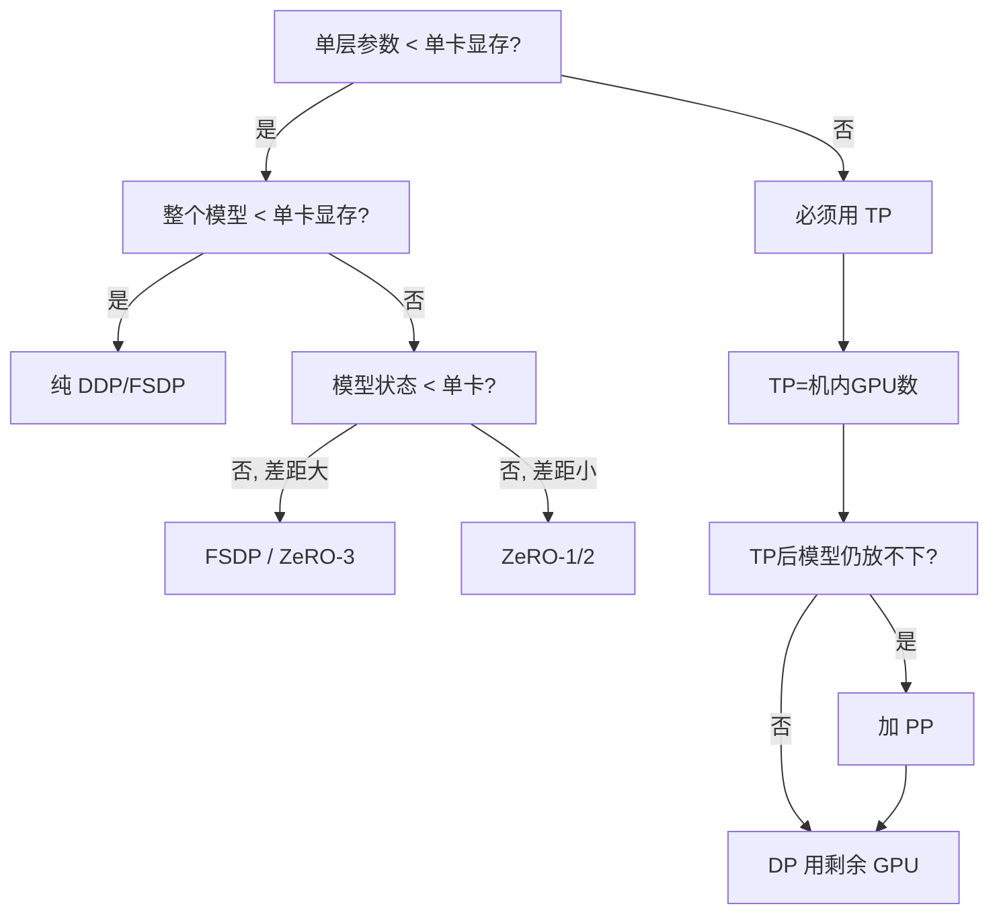

# 训练并行策略选型指南

> 给定模型大小、硬件配置和训练需求，如何选择 DP/TP/PP/EP 的组合？

## 选型决策树



## 速查表

| 模型规模 | 推荐策略 (8卡/机) | 说明 |
|---------|------------------|------|
| **< 2B** | DDP (DP=N) | 单卡放得下，纯数据并行 |
| **2-10B** | ZeRO-2 (DP=N) | 优化器分片节省显存，通信量和DDP相同 |
| **10-30B** | TP=8 + DP=N/8 | 单卡放不下需要 TP，机内 NVLink |
| **30-100B** | TP=8 + PP=2-4 + DP | 需要 PP 跨机，DP 用剩余维度 |
| **100B+** | TP=8 + PP=4-16 + DP + ZeRO-1 | 全套并行 + 优化器分片 |
| **MoE (如 8×7B)** | EP=8 + DP + (可选 TP) | EP 替代 MoE 层的 TP，非 MoE 层用 TP |

## 约束条件

```
硬件约束:
  TP degree ≤ 机内 GPU 数（不跨机！NVLink >> IB）
  PP microbatch 数 ≥ 4 × PP degree（控制 bubble < 20%）
  num_attention_heads % TP == 0（head 数必须能被 TP 整除）
  num_layers % PP == 0（层数必须能被 PP 整除）

性能约束:
  Global batch size = micro_batch × DP × gradient_accumulation
  Global batch size 不能太大（影响收敛）也不能太小（GPU 利用率低）
  通常 LLM 训练 global batch 从小到大 warmup（如 256 → 4096）

显存约束:
  每卡显存 ≥ 模型状态/N + 激活值 + KV缓存 + 框架开销
  激活值 ∝ micro_batch × seq_len × hidden_size
  激活值可以用 gradient checkpointing 换时间降内存
```

## 调优流程

```
1. 确定 TP:
   单层参数 > ~2GB → TP=8 (DGX) 或 TP=4
   否则 TP=1 (不需要 TP)

2. 确定 PP:
   TP 后模型状态仍 > 单卡显存 → 加 PP
   PP = ceil(模型状态 / 单卡可用显存)
   
3. 确定 DP:
   DP = 总 GPU / (TP × PP)
   DP 太小 (<4) 可能 global batch 不够 → 增加 gradient accumulation

4. 确定 ZeRO stage:
   DP 内进一步优化显存:
     显存够: 不用 ZeRO 或 ZeRO-1
     差一点: ZeRO-2
     差很多: ZeRO-3 / FSDP

5. Profile 验证:
   跑 10-50 步 → 记录 step time、MFU、通信占比
   如果通信占比 > 30% → 调整并行配置
   如果 MFU < 30% → 找瓶颈（参考 08-04 监控章节）
```

## 延伸阅读

- [Efficient Large-Scale Language Model Training on GPU Clusters](https://arxiv.org/abs/2104.04473) — Megatron-LM 3D 并行论文
- [DeepSpeed ZeRO Tutorial](https://www.deepspeed.ai/tutorials/zero/)
