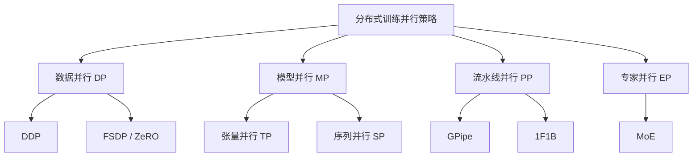

# 06 - 分布式训练

> 从单机到千卡集群：大模型训练的核心并行策略与通信机制。

## 本章内容

| 文件 | 主题 | 要点 |
|------|------|------|
| [01-communication-primitives.md](01-communication-primitives.md) | 通信原语 | AllReduce、NCCL、Ring/Tree 算法 |
| [02-data-parallel.md](02-data-parallel.md) | 数据并行 | DDP、FSDP、ZeRO Stage 1/2/3 |
| [03-tensor-parallel.md](03-tensor-parallel.md) | 张量并行 | Megatron-style 列/行切分 |
| [04-pipeline-parallel.md](04-pipeline-parallel.md) | 流水线并行 | GPipe、1F1B、Interleaved |
| [05-expert-parallel.md](05-expert-parallel.md) | 专家并行 | Mixture of Experts、All-to-All |
| [06-deepspeed.md](06-deepspeed.md) | DeepSpeed | ZeRO 系列、Offload、Inference |
| [07-megatron-lm.md](07-megatron-lm.md) | Megatron-LM | 3D 并行、序列并行、实战配置 |
| [08-training-strategy-guide.md](08-training-strategy-guide.md) | **选型指南** | 给定模型/硬件如何选择并行策略 |

## 为什么需要分布式训练？

```
GPT-3: 175B 参数
  - FP16 模型大小: 175B × 2 bytes = 350 GB
  - 训练所需显存 (Adam): ~350 × 16 = 5.6 TB (模型+梯度+优化器状态)
  - 单卡 H100: 80 GB
  
→ 至少需要 70 张 H100 才能**装下**模型
→ 要在合理时间训完，需要 1000+ 张卡
```

## 并行策略总览



## 学完本章你能回答

1. AllReduce 的 Ring 算法为什么通信量是 $2(N-1)/N \times \text{data\_size}$？
2. ZeRO Stage 1/2/3 分别切分了什么？各自的通信开销是多少？
3. 张量并行中，列切分 $f$ 和 $\bar{f}$ 为什么一个是 identity 一个是 AllReduce？
4. 流水线并行中 bubble 比例的计算公式是什么？如何减少 bubble？
5. MoE 中 Expert 之间的通信模式为什么是 All-to-All？
