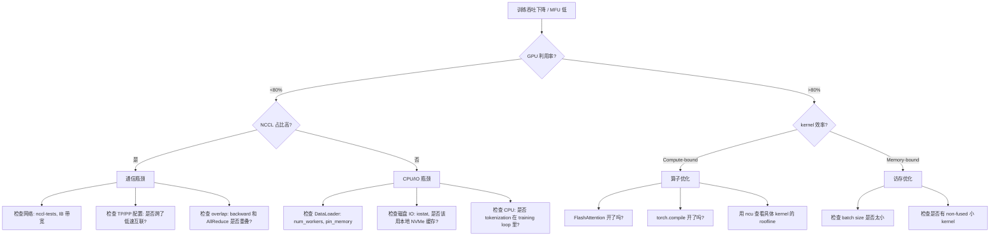

# 监控与可观测性

> 从指标采集到故障排查——训练系统的可观测性是保证 GPU 不浪费的关键。

## 核心概念

### 两类指标体系

```
系统指标 (基础设施层):
  → GPU 利用率、显存、温度、功耗、NVLink/IB 带宽、磁盘 IO
  → 回答: "硬件健康吗？资源用满了吗？"
  → 工具: DCGM, nvidia-smi, node_exporter

训练指标 (应用层):
  → Step Time、Throughput (tokens/s)、MFU、Loss、Learning Rate
  → 回答: "训练效率高吗？模型在收敛吗？"
  → 工具: PyTorch Profiler, W&B, TensorBoard
```

### 关键指标详解

| 指标 | 采集方式 | 健康范围 | 异常含义 |
|------|---------|---------|---------|
| **GPU SM Utilization** | DCGM | >90% | 低→数据加载瓶颈或通信等待 |
| **GPU Memory Utilization** | DCGM | 80-95% | 太低→浪费，太高→OOM 风险 |
| **GPU Temperature** | DCGM | <83°C | 高→降频，检查散热 |
| **GPU Power** | DCGM | 接近 TDP | 远低于 TDP→GPU 没跑满 |
| **NVLink Bandwidth** | DCGM | 接近峰值 | 低→TP 通信可能不走 NVLink |
| **IB Port Throughput** | ib_counters | 接近线速 | 低→网络配置问题或 oversubscription |
| **Step Time** | 训练代码 | 稳定 | 波动大→stragglers 或 IO 抖动 |
| **MFU** | 计算 | >40% | <30%→有严重瓶颈需排查 |
| **Tokens/s** | 训练代码 | 线性 scale | scale out 后不增长→通信瓶颈 |
| **Loss** | 训练代码 | 平滑下降 | NaN→数值溢出，突升→数据问题 |

### DCGM 监控部署

```
┌──────────────────────────────────────────────┐
│          Grafana Dashboard                    │
│  GPU Util | Memory | Temp | NVLink | Errors   │
└──────────────┬───────────────────────────────┘
               │ PromQL
┌──────────────▼───────────────────────────────┐
│          Prometheus                            │
│  scrape_interval: 15s                          │
└──────────────┬───────────────────────────────┘
               │ /metrics
┌──────────────▼───────────────────────────────┐
│  dcgm-exporter (DaemonSet, 每节点一个)         │
│  → 通过 DCGM API 采集 GPU 指标                │
│  → 暴露为 Prometheus 格式                      │
└──────────────────────────────────────────────┘
```

```bash
# 关键 DCGM 指标
DCGM_FI_DEV_GPU_UTIL              # SM 活跃率 (%)
DCGM_FI_DEV_MEM_COPY_UTIL         # 显存控制器繁忙率 (%)
DCGM_FI_DEV_GPU_TEMP              # 温度 (°C)
DCGM_FI_DEV_POWER_USAGE           # 实时功耗 (W)
DCGM_FI_DEV_NVLINK_BANDWIDTH_TOTAL  # NVLink 总带宽
DCGM_FI_DEV_XID_ERRORS            # XID 错误（硬件/驱动问题的信号）

# XID 错误是关键告警:
#   XID 48: Double Bit ECC Error → 显存硬件问题，需要换卡
#   XID 63: ECC Page Retirement → 显存页退役
#   XID 79: GPU Fallen Off Bus → GPU 从 PCIe 掉线
#   XID 31/32: 应用导致的 GPU 异常 → 检查代码/OOM
```

### MFU 计算与监控

```python
def compute_mfu(model_params, tokens_per_step, step_time, 
                gpu_count, gpu_peak_flops):
    """
    model_params: 模型参数量 (如 7e9)
    tokens_per_step: 每步处理的 token 数 (batch_size × seq_len)
    step_time: 每步耗时（秒）
    gpu_count: GPU 数量
    gpu_peak_flops: 单卡峰值 FLOPS (H100 BF16 = 1979e12)
    """
    # 6P 近似只适用于 dense Transformer 的粗略估算。
    # 实际值会受 attention、激活重算、MoE、序列并行等因素影响。
    flops_per_step = 6 * model_params * tokens_per_step
    achieved_flops = flops_per_step / step_time
    peak_flops = gpu_count * gpu_peak_flops
    mfu = achieved_flops / peak_flops
    return mfu

# 实时监控
class MFUTracker:
    def __init__(self, model_params, gpu_count, gpu_peak_flops):
        self.model_params = model_params
        self.gpu_count = gpu_count
        self.gpu_peak_flops = gpu_peak_flops
        self.step_times = []
    
    def log_step(self, tokens, step_time):
        mfu = compute_mfu(
            self.model_params, tokens, step_time,
            self.gpu_count, self.gpu_peak_flops
        )
        self.step_times.append(step_time)
        # 输出或发送到 W&B/TensorBoard
        print(f"MFU: {mfu:.1%} | Step: {step_time:.2f}s | "
              f"Tokens/s: {tokens/step_time:.0f}")
```

MFU 很有用，但不要把它当成唯一真理：

- 不同模型结构下，MFU 的可比性有限
- attention、MoE、重算和 padding 都会影响这个近似
- 它更适合用来观察同一训练配置的趋势，而不是跨项目直接横比

## 性能排障工具链

### 各工具解决什么问题

```
问题               用什么工具                     看什么
────────────────────────────────────────────────────────────────
GPU 利用率低        nvidia-smi / DCGM              SM utilization, memory util
某个 kernel 慢      Nsight Compute (ncu)           Roofline, stall 原因, occupancy
通信占比高          Nsight Systems (nsys)           NCCL 操作在时间线中的占比
NCCL 性能差         nccl-tests                     all_reduce_perf 对比理论带宽
NCCL 卡住          NCCL_DEBUG=INFO                看到哪一步卡住, 哪个 rank
数据加载慢          PyTorch Profiler               DataLoader 时间占比
PyTorch 算子瓶颈    PyTorch Profiler               按 CUDA time 排序的算子表
step time 抖动      Nsight Systems + step log      看时间线中的异常间隔
Loss NaN           torch.autograd.detect_anomaly   定位第一个产生 NaN 的算子
显存 OOM           torch.cuda.memory_summary()     峰值分配分析
```

### 训练变慢的排障流程



### 一个更实用的排障 runbook

当训练“变慢了”时，先按下面顺序收窄问题：

1. **先看是不是所有 rank 都慢**
  如果只有个别 rank 慢，优先怀疑 straggler、热降频、NUMA 不亲和或单节点网络异常。

2. **再看慢的是计算、通信还是 IO**
  结合 step log、GPU util、NCCL 时间线、DataLoader 占比做一轮分类，不要一上来就抓 profiler 全量 trace。

3. **再决定用哪类工具深挖**
  算子问题用 PyTorch Profiler / Nsight Compute，通信问题用 nccl-tests / Nsight Systems，系统问题用 DCGM / 节点监控。

4. **最后再改参数**
  很多团队会先改 batch size、NCCL 参数或 DataLoader workers，但如果根因是坏卡、坏链路或共享存储抖动，这些调参只会掩盖问题。

### 典型故障案例

```
案例 1: 64 卡训练突然变慢（MFU 从 42% 降到 28%）
  排查:
    1. nvidia-smi → 发现某台机器的 GPU 时钟频率降了（降频）
    2. GPU 温度 92°C（超过 throttle 阈值 83°C）
    3. 机房空调故障 → 物理温度过高
  处理: 修复空调，临时将该节点移出训练

案例 2: 256 卡训练 NCCL 间歇性超时
  排查:
    1. NCCL_DEBUG=INFO → 显示 all-reduce 在某些 step 耗时从 5ms 跳到 500ms
    2. IB 端口计数器 → 发现跨机架链路有 CRC 错误
    3. 光模块衰减 → 更换光纤
  处理: 更换问题光纤，错误消失

案例 3: step time 每隔 50 步有一个毛刺
  排查:
    1. 排除 checkpoint（保存间隔 1000 步）
    2. PyTorch Profiler → 毛刺 step 的 DataLoader 时间异常长
    3. 共享文件系统 → 其他训练任务的 checkpoint 写入导致 IO 抢占
  处理: 训练数据迁移到本地 NVMe 缓存

案例 4: scale 从 8 卡到 64 卡后 MFU 从 48% 降到 22%
  排查:
    1. nsys → NCCL AllReduce 占整个 step 时间的 60%
    2. nccl-tests → 跨机架带宽只有 5 GB/s（预期 25 GB/s）
    3. 交换机配置 → 跨机架 4:1 oversubscription
  处理: 升级跨机架带宽到 2:1 oversubscription
```

## 常见问题

**Q: MFU 多少算正常？**

A: 单机 8 卡：45-55%。小集群 (<64 卡)：35-50%。大集群 (256+ 卡)：30-45%。如果低于这些范围，通常有具体的瓶颈值得排查。

**Q: PyTorch Profiler 和 Nsight Systems 有什么区别？**

A: PyTorch Profiler 从框架层面看（哪个 PyTorch 算子慢），Nsight Systems 从系统层面看（GPU kernel、CUDA API、NCCL、CPU 活动的完整时间线）。通常先用 PyTorch Profiler 定位大方向，再用 Nsight Systems 深挖。

**Q: 怎么区分 Straggler（落后 GPU）和全局瓶颈？**

A: 记录每个 rank 的 step time。如果某些 rank 始终比其他慢 >20%，就是 straggler（可能是硬件问题、热降频、或 NUMA 不亲和）。如果所有 rank 都慢，就是全局瓶颈（网络、IO、或配置问题）。

## 延伸阅读

- [NVIDIA DCGM Documentation](https://docs.nvidia.com/datacenter/dcgm/)
- [dcgm-exporter](https://github.com/NVIDIA/dcgm-exporter) — Prometheus 集成
- [Nsight Systems User Guide](https://docs.nvidia.com/nsight-systems/)
- [PyTorch Profiler Tutorial](https://pytorch.org/tutorials/recipes/recipes/profiler_recipe.html)
- [Weights & Biases](https://wandb.ai/) — 训练实验跟踪

---

## 术语表

| 术语 | 说明 |
|------|------|
| **DCGM** | Data Center GPU Manager，NVIDIA 的 GPU 集群监控工具，采集利用率、温度、功耗、错误等指标 |
| **dcgm-exporter** | 将 DCGM 指标导出为 Prometheus 格式的组件，通常作为 DaemonSet 部署在每个节点 |
| **MFU** | Model FLOPs Utilization = 实际 FLOPS / 理论峰值 FLOPS。衡量训练效率的核心指标 |
| **XID Error** | NVIDIA GPU 的硬件/驱动错误代码。不同 XID 对应不同类型的故障（如显存错误、GPU 掉线） |
| **Straggler** | 训练集群中持续比其他 GPU 慢的某个 GPU/节点，拖慢整体训练速度 |
| **Prometheus + Grafana** | 开源监控栈。Prometheus 采集和存储时序指标，Grafana 做可视化展示 |
| **W&B (Weights & Biases)** | 训练实验跟踪平台，记录 loss、学习率、GPU 指标等 |
