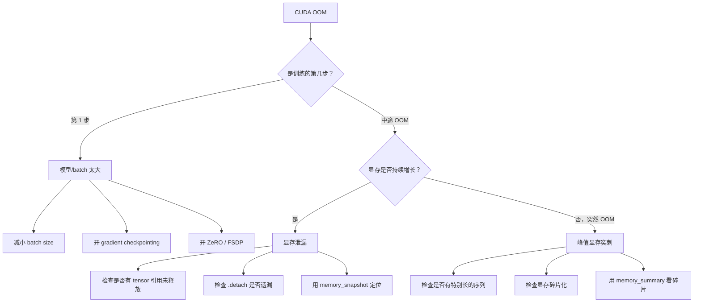

# 高级调试手册（Debugging Runbook）

> 分布式 GPU 训练的排障需要系统化方法——本章提供从 NCCL 调试、训练挂起诊断到 CUDA 错误排查的完整 runbook。

## 调试哲学

分布式 GPU 系统的调试和单机程序完全不同：

- **问题的可观测性差**：128 张卡中某一张卡的间歇性错误可能导致整个训练挂起
- **根因往往在意想不到的地方**：你以为是代码 bug，实际上是光纤衰减；你以为是 OOM，实际上是显存碎片
- **不能靠猜**：必须按照系统化的流程逐层排查

核心原则：**先缩小范围（哪一层？哪个节点？哪个操作？），再深入分析**。

## NCCL 调试

NCCL（NVIDIA Collective Communications Library）是分布式训练通信的基础。大部分分布式训练的问题最终都指向 NCCL。

### 环境变量

```bash
# 基础调试信息（推荐始终开启）
export NCCL_DEBUG=INFO

# 详细子系统日志
export NCCL_DEBUG_SUBSYS=ALL    # 所有子系统
# 也可以选择性开启:
# INIT  - 初始化过程
# NET   - 网络相关
# GRAPH - 拓扑图
# TUNING - 算法选择

# 指定网络接口（多网卡环境必须设置）
export NCCL_SOCKET_IFNAME=eth0     # 使用 eth0
export NCCL_SOCKET_IFNAME=^docker0 # 排除 docker0

# 导出拓扑信息（排查 NVLink/PCIe 路由问题）
export NCCL_TOPO_DUMP_FILE=/tmp/nccl_topo.xml
```

### 常见错误解读

| 错误信息 | 通常原因 | 排查方向 |
|---------|---------|---------|
| `unhandled system error` | 硬件/驱动问题 | 检查 `dmesg`、GPU XID 错误、驱动版本 |
| `Connection refused` | 节点间网络不通 | 检查防火墙、端口、NCCL_SOCKET_IFNAME |
| Timeout / 挂起 | 死锁、负载不均、慢节点 | 分 rank 检查，见下节 |
| `invalid usage` | NCCL API 调用错误 | 检查 tensor shape/dtype 是否一致 |
| `out of memory` | 通信 buffer 分配失败 | 减小 NCCL_BUFFSIZE 或增加显存预留 |

### NCCL 拓扑与算法

```bash
# 查看 NCCL 选择的通信算法和协议
NCCL_DEBUG=INFO python train.py 2>&1 | grep -i "algo\|proto\|channel"

# 典型输出:
# NCCL INFO Channel 00/04 : 0 1 2 3 4 5 6 7
# NCCL INFO algo Ring proto Simple
# → 使用 Ring 算法，Simple 协议，4 个 channel
```

## 分布式训练挂起诊断

训练挂起（hang）是最棘手的问题之一。按以下流程系统排查：

### Step 1: 是单个 rank 挂起还是全部？

```bash
# 方法 1: 每个 rank 打印心跳日志
# 在训练代码中添加:
if step % 10 == 0:
    print(f"[Rank {rank}] Step {step} completed", flush=True)

# 方法 2: py-spy 附加到挂起进程
pip install py-spy
py-spy dump --pid <python_pid>
# 能看到 Python 堆栈，判断卡在哪个调用

# 方法 3: gdb 附加（看 C++ 层）
gdb -p <pid> -batch -ex "thread apply all bt"
```

### Step 2: 是否卡在某个 collective 操作？

```bash
# 开启 NCCL 详细日志
NCCL_DEBUG=INFO NCCL_DEBUG_SUBSYS=ALL python train.py 2>&1 | tee nccl.log

# 看最后一条 NCCL 操作是什么
tail -100 nccl.log | grep -i "launch\|enqueue"
# 如果所有 rank 都停在同一个 AllReduce → 某个 rank 没有到达该 collective
```

### Step 3: 是数据加载问题吗？

```bash
# 单独测试数据管线
python -c "
from train import get_dataloader
dl = get_dataloader()
import time
for i, batch in enumerate(dl):
    if i % 100 == 0: print(f'Batch {i}', flush=True)
    if i > 500: break
"
# 如果这里也卡住 → 是数据加载/预处理的问题，不是通信
```

### Step 4: 是硬件故障吗？

```bash
# GPU 健康检查
nvidia-smi                         # 基本状态
nvidia-smi -q -d ECC               # ECC 错误
nvidia-smi -q -d PAGE_RETIREMENT   # 显存页退役

# 检查系统日志（XID 错误）
dmesg | grep -i "nvrm\|xid\|gpu"
# XID 48: Double Bit ECC → 需要换卡
# XID 79: GPU Fallen Off Bus → GPU 掉线

# DCGM 全面诊断
dcgmi diag -r 3    # Level 3 诊断（包含 stress test）
```

### PyTorch 内置调试工具

```bash
# 开启分布式调试（会检查集合操作参数一致性）
export TORCH_DISTRIBUTED_DEBUG=DETAIL

# 这会:
# 1. 检查每个 collective 的输入 tensor shape/dtype 是否所有 rank 一致
# 2. 打印每个 collective 的调用栈
# 3. 在不一致时立即报错（而不是挂起）
```

## CUDA 调试工具

### CUDA_LAUNCH_BLOCKING

```bash
# 让所有 CUDA 操作同步执行
CUDA_LAUNCH_BLOCKING=1 python train.py

# 默认情况下 CUDA 操作是异步的:
#   报错位置 ≠ 实际出错的 kernel
# 开启后:
#   每个 kernel 执行完才继续 → 报错位置准确
#   但性能会大幅下降，仅用于调试
```

### compute-sanitizer

```bash
# memcheck: 检测越界访问、未对齐访问
compute-sanitizer --tool memcheck python train.py
# 类似 CPU 的 valgrind，发现 CUDA kernel 中的内存错误

# racecheck: 检测 shared memory 竞争条件
compute-sanitizer --tool racecheck python train.py
# 发现 shared memory 的 read-after-write / write-after-write 竞争

# initcheck: 检测读取未初始化显存
compute-sanitizer --tool initcheck python train.py
```

### cuda-gdb

```bash
# 调试 CUDA kernel（需要 -G 编译选项）
cuda-gdb python
(cuda-gdb) run train.py
(cuda-gdb) break my_kernel           # 在 kernel 函数设断点
(cuda-gdb) cuda thread (0,0,0)       # 切换到特定线程
(cuda-gdb) info cuda threads         # 查看所有 CUDA 线程
```

## 常见故障模式

### NaN/Inf 梯度

```python
# 检测 NaN 出现的位置
torch.autograd.set_detect_anomaly(True)
# 会在第一个产生 NaN 的反向传播操作处抛出异常
# 注意: 非常慢，只用于定位问题

# 常见原因和缓解:
# 1. Loss scale 不合适 → 使用 GradScaler 的动态 loss scaling
# 2. 学习率过大 → 加 warmup
# 3. 数据中有异常值 → 检查数据预处理
# 4. 某层输出爆炸 → 加 gradient clipping
optimizer.step()
torch.nn.utils.clip_grad_norm_(model.parameters(), max_norm=1.0)
```

### OOM 诊断流程



```python
# 诊断显存使用
print(torch.cuda.memory_summary())

# 关键字段:
# "Allocated memory" - 实际被 tensor 使用的显存
# "Reserved memory"  - PyTorch 从 CUDA 申请的总量
# "Inactive"         - 已缓存但未使用的块（碎片的信号）
```

### 训练变慢排查清单

```
□ GPU 利用率是否正常？
  nvidia-smi dmon -s u -d 1
  → 如果 <80%，可能是 IO 或通信瓶颈

□ 是否有 straggler（落后的 GPU）？
  比较每个 rank 的 step time
  → 个别 rank 慢 20%+ 就是 straggler

□ 通信开销是否合理？
  用 Nsight Systems 看 NCCL 占比
  → AllReduce 占比 >30% 需要优化

□ 数据加载是否是瓶颈？
  看 DataLoader 等待时间
  → 增加 num_workers / 用本地 NVMe

□ 是否有显存碎片导致的 cudaMalloc 重分配？
  torch.cuda.memory_stats()['num_alloc_retries']
  → 大于 0 说明有碎片
```

### 可复现性问题

```python
# 完全确定性训练（会损失性能）
import torch
torch.manual_seed(42)
torch.cuda.manual_seed_all(42)
torch.backends.cudnn.deterministic = True
torch.backends.cudnn.benchmark = False
torch.use_deterministic_algorithms(True)

# cuBLAS 确定性需要额外设置
import os
os.environ['CUBLAS_WORKSPACE_CONFIG'] = ':4096:8'
# 没有这行，cuBLAS 在某些配置下结果不确定
```

## Profiling 工作流

遇到性能问题时，按层级递进分析：

### Step 1: 宏观判断——compute-bound 还是 memory-bound？

```bash
# Nsight Systems 系统级 profile
nsys profile -o overview \
    --trace=cuda,nvtx,osrt \
    --cuda-memory-usage=true \
    python train.py --max-steps 10

# 看 GPU 利用率 timeline:
# - GPU 一直在跑 kernel → compute-bound
# - GPU 经常空闲 → 等 CPU / IO / 通信
```

### Step 2: 哪个操作最慢？

```python
# PyTorch Profiler
from torch.profiler import profile, ProfilerActivity

with profile(activities=[ProfilerActivity.CPU, ProfilerActivity.CUDA]) as prof:
    for step in range(5):
        loss = model(batch).loss
        loss.backward()
        optimizer.step()
        optimizer.zero_grad()

print(prof.key_averages().table(sort_by="cuda_time_total", row_limit=10))
# 找到占时间最多的 top 算子
```

### Step 3: 单个 kernel 为什么慢？

```bash
# Nsight Compute 深入分析特定 kernel
ncu --set full \
    --kernel-name "ampere_sgemm" \
    -o kernel_detail \
    python train.py --max-steps 2

# 关注:
# - Roofline 定位: 是 compute-bound 还是 memory-bound
# - Occupancy: SM 利用率是否够高
# - Stall reasons: warp 为什么在等待
```

### Step 4: 通信是否是瓶颈？

```bash
# 单独测试 NCCL 性能
# 安装 nccl-tests
./build/all_reduce_perf -b 1M -e 1G -f 2 -g 8

# 对比理论带宽:
# H100 NVLink: ~450 GB/s (单向)
# 400G IB:     ~48 GB/s (单向)
# 如果实测远低于理论值 → 网络配置问题
```

## 快速参考命令

```bash
# ─── GPU 监控 ───
nvidia-smi                              # GPU 基本状态
nvidia-smi dmon -s u -d 1               # 实时监控 GPU 利用率（每秒）
nvidia-smi topo -m                      # GPU 互联拓扑（NVLink/PCIe）
nvidia-smi -q -d CLOCK                  # 时钟频率（是否降频）

# ─── InfiniBand ───
ibstat                                  # IB 端口状态
ibstatus                                # IB 端口详细信息
iblinkinfo                              # IB 链路信息
perfquery                               # IB 性能计数器

# ─── DCGM 诊断 ───
dcgmi discovery -l                      # 列出 GPU
dcgmi diag -r 1                         # Level 1: 快速检查
dcgmi diag -r 2                         # Level 2: 中等检查
dcgmi diag -r 3                         # Level 3: 全面检查（含 stress test）

# ─── NCCL 调试 ───
NCCL_DEBUG=INFO python train.py         # 基础 NCCL 日志
NCCL_DEBUG=TRACE python train.py        # 详细 NCCL 跟踪

# ─── PyTorch 调试 ───
CUDA_LAUNCH_BLOCKING=1 python train.py  # 同步 CUDA（定位报错位置）
TORCH_DISTRIBUTED_DEBUG=DETAIL python train.py  # 分布式调试
TORCH_SHOW_CPP_STACKTRACES=1 python train.py    # 显示 C++ 堆栈

# ─── 系统日志 ───
dmesg | grep -i "nvrm\|xid\|gpu\|error" # GPU 相关内核日志
journalctl -u nvidia-fabricmanager       # NVSwitch fabric manager 日志
```

## 延伸阅读

- [NCCL Documentation](https://docs.nvidia.com/deeplearning/nccl/)
- [NCCL Troubleshooting](https://docs.nvidia.com/deeplearning/nccl/user-guide/docs/troubleshooting.html)
- [compute-sanitizer User Guide](https://docs.nvidia.com/compute-sanitizer/ComputeSanitizer/index.html)
- [PyTorch Distributed Debugging](https://pytorch.org/docs/stable/distributed.html#debugging)
- [NVIDIA GPU Debug Guidelines](https://docs.nvidia.com/deploy/xid-errors/)

---

## 术语表

| 术语 | 说明 |
|------|------|
| **NCCL** | NVIDIA Collective Communications Library，GPU 间集合通信库（AllReduce、AllGather 等） |
| **Graph Break** | torch.compile 遇到无法跟踪的代码时，将计算图断开的行为 |
| **XID Error** | NVIDIA GPU 的硬件/驱动错误代码，通过 dmesg 查看 |
| **compute-sanitizer** | NVIDIA 的 CUDA 内存/竞争检测工具，类似 CPU 上的 valgrind |
| **cuda-gdb** | CUDA 专用调试器，可以在 GPU kernel 中设断点 |
| **CUDA_LAUNCH_BLOCKING** | 环境变量，设为 1 后所有 CUDA 操作同步执行，方便定位错误 |
| **py-spy** | Python 性能采样工具，可以不修改代码附加到运行中进程查看调用栈 |
| **Straggler** | 训练集群中持续比其他 GPU 慢的某个 GPU/节点 |
| **DCGM** | Data Center GPU Manager，NVIDIA 的 GPU 集群管理和诊断工具 |
| **nccl-tests** | NCCL 官方性能测试工具，用于验证节点间通信带宽是否达标 |
| **Deterministic Algorithms** | 确定性算法，确保相同输入产生完全相同的输出，用于调试可复现性问题 |
