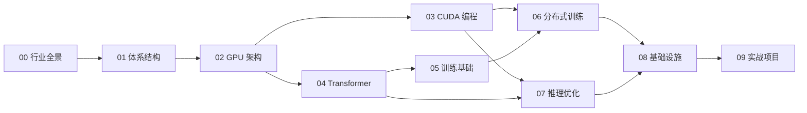

# GPU & AI Systems 学习指南

> 面向有后端经验的工程师，系统性掌握大模型训练与推理优化的核心知识。

## 📋 目录

| 章节 | 主题 | 难度 | 说明 |
|------|------|------|------|
| [00-industry-overview](00-industry-overview/README.md) | LLM 行业全景 | ⭐ | 数据规模、团队结构、成本与商业模型 |
| [01-computer-architecture](01-computer-architecture/README.md) | 计算机体系结构 | ⭐⭐ | 精简回顾 + HPC 视角补充 |
| [02-gpu-architecture](02-gpu-architecture/README.md) | GPU 架构 | ⭐⭐⭐ | **重点** — 理解 GPU 硬件是一切优化的基础 |
| [03-cuda-programming](03-cuda-programming/README.md) | CUDA 编程 | ⭐⭐⭐ | **重点** — 从入门到 GEMM 优化实战 |
| [04-transformer-deep-dive](04-transformer-deep-dive/README.md) | Transformer 深入 | ⭐⭐ | 模型架构 + 计算/显存分析 |
| [05-training-fundamentals](05-training-fundamentals/README.md) | 训练基础 | ⭐⭐ | 混合精度、Checkpointing、Profiling |
| [06-distributed-training](06-distributed-training/README.md) | 分布式训练 | ⭐⭐⭐ | **重点** — 通信原语到多机训练框架 |
| [07-inference-optimization](07-inference-optimization/README.md) | 推理优化 | ⭐⭐⭐ | **重点** — KV-cache 到 vLLM/TensorRT-LLM |
| [08-infrastructure](08-infrastructure/README.md) | 基础设施 | ⭐⭐ | 集群网络、存储、K8s GPU 调度 |
| [09-hands-on-projects](09-hands-on-projects/README.md) | 实战项目 | ⭐⭐⭐ | 动手练习指南 |
| [resources](resources/version-baseline.md) | 资源汇总 | — | 版本基线、书籍、论文、课程、工具 |

> 版本说明：容易过期的框架接口、CLI 和性能结论以 [版本基线](resources/version-baseline.md) 为准；部署前请再次核对官方文档和当前版本的 `--help` 输出。

## 🗺️ 学习路线图

## 📅 按周学习计划（建议 12 周）

### Phase 1：基础（Week 1-3）

- [ ] **Week 1**：Ch01 体系结构回顾 + Ch02 GPU 架构（GPU vs CPU、SM 架构、显存层级）
- [ ] **Week 2**：Ch03 CUDA 编程基础（kernel、内存管理、shared memory）
- [ ] **Week 3**：Ch03 CUDA 优化技巧 + GEMM Case Study + Triton 入门

### Phase 2：模型与训练（Week 4-6）

- [ ] **Week 4**：Ch04 Transformer 深入（Attention、FLOPs/显存分析、常见架构）
- [ ] **Week 5**：Ch05 训练基础（混合精度、Gradient Checkpointing、Profiling）
- [ ] **Week 6**：Ch06 分布式训练（通信原语、Data Parallel — DDP/FSDP/ZeRO）

### Phase 3：分布式与推理（Week 7-9）

- [ ] **Week 7**：Ch06 分布式训练（Tensor/Pipeline/Expert Parallel）
- [ ] **Week 8**：Ch06 DeepSpeed & Megatron-LM 实战
- [ ] **Week 9**：Ch07 推理优化（KV-cache、量化、Continuous Batching）

### Phase 4：高级推理与实战（Week 10-12）

- [ ] **Week 10**：Ch07 推理优化（Speculative Decoding、FlashAttention、vLLM）
- [ ] **Week 11**：Ch07 TensorRT-LLM + Ch08 基础设施
- [ ] **Week 12**：Ch09 实战项目（选择 1-2 个动手完成）

## 🎯 前置假设

本仓库假设你已具备：

- **Linux 系统编程**：熟悉进程/线程模型、内存管理、`perf` 等工具
- **C/C++ 编程**：能读写中等复杂度的 C++ 代码
- **Python & PyTorch 基础**：能用 PyTorch 搭建简单模型并训练
- **后端工程经验**：了解分布式系统、网络、存储、容器化部署

## 📖 如何使用

1. **按章节顺序阅读**：每个章节内的文件有序号，建议按序阅读
2. **关注 Mermaid 图**：架构图和流程图用 Mermaid 绘制，GitHub 原生支持渲染
3. **动手实践**：关键章节附有代码或伪代码示例，建议边读边试
4. **打勾跟踪**：用上方的学习计划 checkbox 跟踪进度（需要 fork 后在自己的 repo 打勾）
5. **手机友好**：所有内容针对 GitHub 移动端阅读优化

## License

[MIT](https://github.com/NightLemon/gpu-ai-systems-learning/blob/master/LICENSE)
